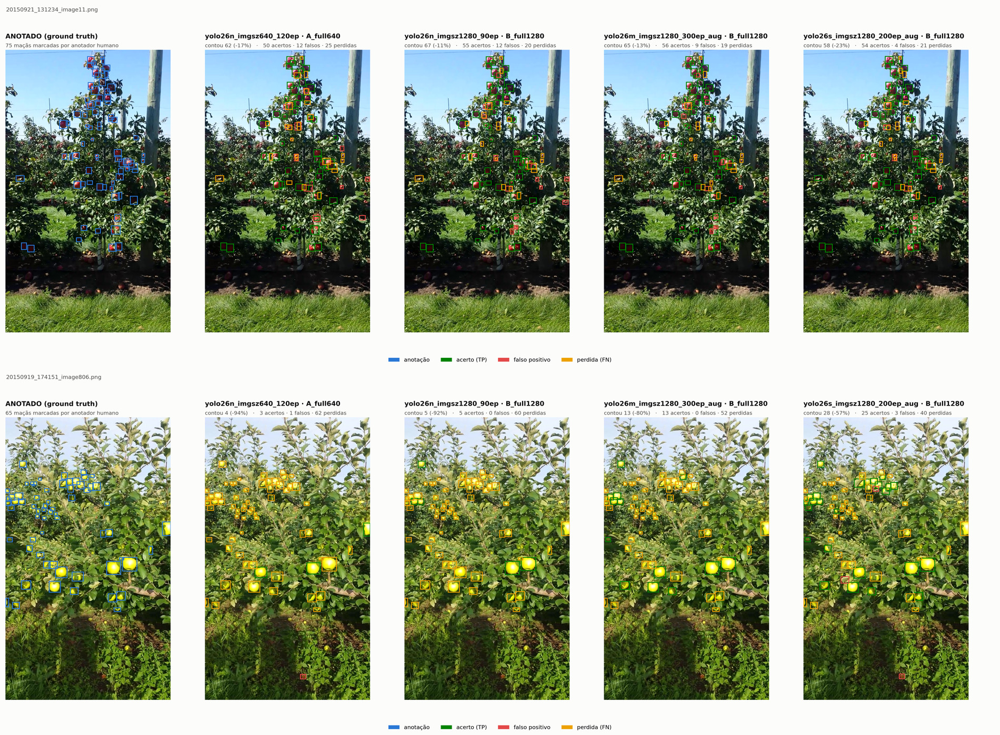

# Detecção e contagem de frutas — Antoniq Robotics

Teste técnico de AI Engineer (Computer Vision). Detecta e **conta** maçãs no
[MinneApple](https://conservancy.umn.edu/handle/11299/206575), reproduzindo o núcleo do
problema de contagem de framboesa: fruta pequena, agrupada, parcialmente ocluída, e **a mesma
fruta aparecendo várias vezes** — em tiles sobrepostos e em quadros consecutivos.


*Um caso típico do quartil superior: **um quarto das imagens fica abaixo de 9% de erro**, a
mediana é 20% e a cauda vai a 166% na pior sessão. A distribuição inteira, e o que a causa,
estão na §5 e na §7 do relatório — este README não esconde a cauda, mas também não começa por
ela.*

O trabalho é organizado em torno de uma tese: **em contagem de fruta, o que quebra o produto
não é o detector, é a duplicata e o viés.** Um falso positivo e um falso negativo na mesma
imagem se cancelam e o erro de contagem some; uma duplicata não removida em cada tile vira um
erro sistemático que se acumula fileira afora. As decisões abaixo seguem daí.

---

## Reproduzir

```bash
pip install -r requirements.txt          # ver nota sobre PyTorch + CUDA no arquivo
python scripts/check_environment.py      # confere versoes de RUNTIME, nao de metadados

# 1. dataset (download manual — ver scripts/00_download.md)
python scripts/01_prepare_data.py        # mascaras -> caixas, splits agrupados, rotulos YOLO

# 2. treino: um YOLO26n por fold + um com split aleatorio (contraprova de vazamento)
python scripts/02_train_cv.py            # ~50 min por fold numa RTX 3050 6 GB
python scripts/02_train_cv.py --smoke    # 2 epocas, so para validar o pipeline

# 3. analise
python scripts/03_eval_arms.py           # SELECIONA na validacao, AVALIA no teste
python scripts/04_error_modes.py         # modos de erro ranqueados pelo custo em contagem
python scripts/05_crossframe.py          # bonus: deduplicacao entre quadros
python scripts/06_figures.py             # figuras do relatorio
python scripts/07_leakage.py             # quanto o split aleatorio infla a metrica
python scripts/08_report.py --open       # relatorio.md -> HTML pronto para Ctrl+P -> PDF
python scripts/09_check_report.py        # confere os numeros do relatorio contra results/
python scripts/10_visual_audit.py        # anotado | imagem inteira | tiles, lado a lado
python scripts/13_scene_overlap.py --full  # ha repeticao de cena entre sessoes? (ORB+RANSAC)

# 4. experimentos da secao 6 do relatorio
python scripts/11_experiments.py --list  # os sete, com a descricao de cada
python scripts/11_experiments.py         # roda a fila (o n@1280 300ep e o m@1280 pedem mais de 6 GB)
python scripts/12_compare_models.py      # todos os pesos na MESMA regua, no teste

# galeria comparando MODELOS na mesma imagem, cada um no seu ponto congelado
python scripts/10_visual_audit.py --models yolo26n_imgsz640_120ep,yolo26n_imgsz1280_90ep,yolo26m_imgsz1280_300ep_aug,yolo26s_imgsz1280_200ep_aug

# a imagem que o console usa para explicar o cancelamento (results/figures/10_cancelamento.jpg)
python scripts/10_visual_audit.py --images 20150921_132038_image151.png --out audit_aula

# o par controlado: os dois YOLO26s @1280, so a augmentacao muda
python scripts/10_visual_audit.py --models yolo26s_imgsz1280_200ep,yolo26s_imgsz1280_200ep_aug \n  --images 20150919_174151_image806.png --out audit_aug

# inferencia ponta a ponta numa imagem qualquer
python scripts/run_inference.py --image caminho/da/imagem.png
python scripts/run_inference.py --image imagem.png --compare   # os quatro bracos

# console de apresentacao: solta uma imagem e ve os quatro bracos lado a lado
pip install -r demo/requirements.txt && python demo/app.py

# reconstroi o indice que o console usa para saber a contagem ANOTADA da imagem recebida.
# demo/gt_index.csv ja vem versionado (o dataset nao vem), so rode se images.csv mudar.
python demo/indexar_gt.py
```

Testes: `python -m pytest tests/ -q` (119 testes)

**Quão reprodutível, medido.** Rodar `03_eval_arms.py` e `04_error_modes.py` de novo sobre as
mesmas detecções brutas reescreve 23.743 linhas em `selection.csv`, `merge_ablation.csv`,
`conf_sweep.csv`, `per_image.csv` e `arms.csv`. Em **todas** elas, as únicas colunas que mudam
são `latency_total_ms` e `latency_merge_ms` — relógio de parede, que depende da carga da
máquina. Todo o resto sai **bit a bit idêntico**: tp, fp, fn, precisão, recall, F1, MAE, viés,
R², inclinação. E `operating_point.json`, `error_ranking.csv`, `error_strata.csv` e
`error_balance.json` saem **byte a byte iguais**, sem exceção nenhuma — inclusive o veredito
go/no-go. O mesmo vale para a tabela de modelos: `12_compare_models.py --analyze` reproduz as
**22 linhas** de `model_comparison.csv` com diferença máxima de **0,3 ms** na latência e **zero**
em qualquer outra coluna. A análise é determinística; o que flutua é só o cronômetro.

> **Não rode a análise ou as figuras durante um treino.** São 15,7 GiB de RAM e o treino segura
> ~1,2 GiB de dataset decodificado; a combinação já esgotou a memória e derrubou um treino. O
> `--resume` de `02_train_cv.py` existe para que isso custe minutos e não a corrida inteira.
> Detalhes em `environment.md`.

### Sem instalar nada

```bash
docker build -t antoniq-fruit .
docker run --rm antoniq-fruit                     # testes + confere o relatorio
# inferencia numa imagem sua: monte a pasta que a contem
docker run --rm -v "/pasta/com/imagens:/data" antoniq-fruit \
  python scripts/run_inference.py --image /data/foto.png --no-image
```

A imagem é de **CPU, de propósito**: ela verifica o trabalho — roda os testes, confere os
números do relatório contra `results/` e faz inferência com os pesos de `models/`. Ela **não
treina**, porque treinar exige CUDA, os 1,9 GB do dataset e horas de GPU, e uma imagem que
prometesse isso seria uma imagem que ninguém testou. As versões de treino estão em
`requirements.txt` e em `environment.md`.

Vale como terceira medida de reprodutibilidade: a mesma imagem de exemplo dá **58 maçãs** nas
duas plataformas — Windows com RTX 3050 e o container Linux em CPU — no mesmo ponto de operação
(`B_full1280`, conf 0,17). O que muda é só a latência, 156 ms contra 312 ms.

Caminhos locais ficam em `configs/paths.yaml`, relativos à raiz — é o único arquivo a ajustar
noutra máquina. Dataset e saídas de treino ficam em **`ml/`** (7,5 GB), dentro da pasta mas
**fora do repositório**: `/ml/` está no `.gitignore`, então o clone tem 101 arquivos.
**Duas exceções vão versionadas, e as duas existem pela mesma razão: reproduzir sem GPU.**

*Os oito checkpoints da §6* (`models/`, 120 MB) — sem eles, refazer a tabela comparativa
exigiria baixar 1,9 GB de dataset e treinar. `run_inference.py` cai neles automaticamente
quando não há peso treinado na máquina; ver `models/README.md`.

*As detecções brutas* (`results/raw_detections/`, 62 MB) — um `.npz` por
(pesos, braço, fold), gravado antes de qualquer limiar ou fusão. Com elas,
`03_eval_arms.py --analyze` refaz a ablação inteira de fusão — 3.240 configurações pareadas —
e `12_compare_models.py` refaz a §6, **sem rodar inferência**. São ~20 h de GPU em 62 MB de
disco, e é o que separa "acredite nos meus CSVs" de "recalcule você mesmo". No mesmo espírito,
`results/instances.csv`, `error_gt.csv` e `error_fp.csv` levam a saída por instância das
Etapas 1 e 4.

O que fica de fora é o que **um comando regenera**: as galerias de auditoria visual
(`results/audit*/`, `results/galeria*/`) e as saídas de `run_inference.py` são PNG derivado
desses mesmos artefatos.

---

## O dataset, e o que ele obriga

| | |
|---|---|
| Imagens rotuladas | **670** — o split de teste oficial (331) tem os rótulos retidos no CodaLab |
| Resolução | **720 x 1280, retrato** (o artigo escreve "1280 x 720", que é altura x largura) |
| Instâncias anotadas | 28.182 |
| Maçãs por imagem | média 42,1 · mediana 39 · **máximo 123** |
| Lado mediano da caixa | **~27 px** |
| Faixas COCO | 69,5% *small* · 30,5% *medium* · **0,0% *large*** |
| Solidez média (proxy de oclusão) | 0,674 — disco perfeito seria 0,785; **20,5% abaixo de 0,60** |
| Licença | **CC BY-NC-SA 3.0 US — não comercial** |

Três consequências que dirigem todo o resto:

**1. As imagens não são independentes.** São quadros extraídos de dez vídeos, gravados
caminhando a ~1 m/s ao longo de fileiras de macieira, um quadro a cada cinco. Quadros vizinhos
mostram as mesmas maçãs. O nome do arquivo entrega a sessão de captura:

```
20150921_131453_image1101.png
|_____________|       |____|
    sessao             quadro no video
```

São exatamente dez sessões. **Um split aleatório por imagem coloca quadros quase idênticos em
treino e em teste** — no baseline aleatório que rodamos de propósito para medir isso, **10 de
10 sessões aparecem simultaneamente em treino e teste do mesmo fold**. Daí o `GroupKFold` por
sessão, com a validação também numa sessão separada (usar quadros do mesmo vídeo do treino
para early stopping reintroduziria o vazamento pela porta dos fundos).

**2. Nenhum objeto "large".** Com 0,0% do dataset acima de 96² px, `AP_large` é indefinido e
não deve ser reportado como métrica.

**3. A licença é não comercial.** Serve para o assessment; não serviria para treinar produto.

---

## Decisões, e por quê

**Tiling implementado do zero, em NumPy/OpenCV** (`src/tiling/`), sem SAHI — é a restrição do
enunciado. A escolha que importa é a **métrica de casamento na fusão**:

> Uma fruta cortada pela aresta de um tile produz uma caixa com ~metade da área da caixa que o
> tile vizinho gera para a mesma fruta. O **IoU** entre as duas fica em torno de 0,5 — em cima
> do limiar usual — e a duplicata escapa de forma imprevisível. O **IoS** (interseção ÷ área da
> **menor** caixa) dá ~1,0 no mesmo par e remove a duplicata sem ambiguidade.

Isso não é detalhe acadêmico: o baseline *Tiled Faster R-CNN* do próprio artigo do MinneApple
ficou **abaixo** da inferência em imagem inteira (AP 0,341 vs 0,438), e os autores atribuem a
perda ao passo de supressão. O `merge.py` permite reproduzir a falha (`metric="iou"`) e
corrigi-la (`metric="ios"`), e a ablação mede as duas. O custo do IoS — suprimir uma fruta
pequena contida na caixa de uma maior — está fixado em teste e reportado, não escondido.

**Quatro estratégias de inferência, os mesmos pesos.** A variável controlada é a inferência:

| Braço | Estratégia | Passes | Escala do objeto |
|---|---|---|---|
| A | imagem inteira @ 640 | 1 | 0,5x |
| B | imagem inteira @ 1280 | 1 | 1,0x |
| C | tile 640, sobreposição 0,2 | 6 (2x3) | 1,0x |
| D | tile 320, sobreposição 0,2 | 15 (3x5) | **2,0x** |

Vale explicitar porque quase nunca é dito: **recortar em 640 e alimentar a rede em 640 não
aumenta o objeto.** O braço C só reduz a densidade por passe. A magnificação de verdade só
aparece no braço D. Se o braço B — mais barato e sem artefato de fusão — vencer o C, isso é o
resultado, não um problema.

**Inferência e pós-processamento desacoplados.** O detector roda **uma vez**, num limiar baixo,
e as detecções brutas vão para disco (`src/inference/store.py`). A ablação de fusão tem 24
combinações e a calibração varre 90 limiares: fundir e filtrar offline transforma milhares de
execuções do detector em uma.

**A ordem do pós-processamento é `limiar -> descarte de borda -> fusão`**, porque é o que um
sistema em produção faz: o detector roda no seu ponto de operação e a fusão recebe o que passou.
Fundir antes e filtrar depois daria números um pouco melhores e não corresponderia ao robô.

**Oito conjuntos de pesos** — os sete de `scripts/11_experiments.py` mais o baseline de
`scripts/02_train_cv.py`, todos versionados em `models/` — medidos na mesma régua pelo pipeline
inteiro (`scripts/12_compare_models.py`), no teste, cada um no braço e no limiar que a **sua**
validação escolheu:

| Pesos | Braço | MAE | F1 | recall | AP50 | AP-small |
|---|---|---|---|---|---|---|
| **YOLO26s @1280 + aug** (9,9 M) | B_full1280 | **12,6** | **0,752** | **0,683** | **0,762** | **0,352** |
| YOLO26s @1280 (9,9 M) | B_full1280 | 15,1 | 0,738 | 0,633 | 0,742 | 0,337 |
| YOLO26m @1280 + aug (21,8 M) | B_full1280 | 19,3 | 0,695 | 0,575 | 0,683 | 0,314 |
| YOLO26n @1280, 90 ép | B_full1280 | 24,7 | 0,634 | 0,484 | 0,643 | 0,290 |
| recortes de 320 px | D_tile320 | 26,6 | 0,607 | 0,453 | 0,487 | 0,227 |
| YOLO26n @1280, 124 ép | A_full640 | 31,1 | 0,507 | 0,358 | 0,463 | 0,157 |
| YOLO11s @640 (9,4 M) | A_full640 | 33,0 | 0,474 | 0,327 | 0,475 | 0,204 |
| baseline @640 (2,5 M) | A_full640 | 33,2 | 0,465 | 0,319 | 0,439 | 0,158 |

**Do baseline ao melhor: MAE −62,0%, recall +113,9%, AP-small +122,8%**, com a precisão custando
só 2,1% (0,854 → 0,836). Resolução paga primeiro, capacidade depois — e **ambas saturam**: a
640 px o YOLO11s com 4x os parâmetros empata com o baseline; a 1280 px, 2,5 M → 9,9 M leva a MAE
de 24,7 a 15,1, mas 9,9 M → 21,8 M **com a mesma augmentação** dá 12,6 contra 19,3. **O joelho
está em ~10 M**, coerente com 450 imagens de treino.

**A alavanca que mais pagou não foi capacidade — foi a augmentação que a análise de erro
encomendou.** Os dois YOLO26s a 1280 têm configuração de treino idêntica menos a augmentação —
`hsv_v` 0,40 →
0,75, `hsv_s` → 0,90, `scale` 0,5 → 0,35, `close_mosaic` 30, as quatro juntas: **MAE 15,1 → 12,6,
recall +7,8%, viés de −28,4% para −18,3%**. O motivo está medido em `results/dataset_summary.json`
— o brilho médio *dentro das caixas* é 98,2 nas sessões de treino e 164–166 nas duas que o modelo
mais erra; com `hsv_v = 0,40` o treino alcança 137 e nunca vê aquela faixa, com 0,75 alcança 172.

Três achados que valem mais que os números acima, todos na §6 do relatório: **o mAP de validação
ficou parado (0,4478 → 0,4480) enquanto a MAE de teste caía 22,8%** ao treinar mais épocas — parar
pelo mAP teria jogado fora quase um quarto do erro; **0,38 maçã de diferença na validação custou
doze pontos de MAE no teste** ao eleger o braço errado; e a validação **preferiu o modelo sem a
augmentação** por 0,90 maçã, enquanto no teste o com augmentação ganha por 2,45 de MAE. Três vezes
o mesmo elo fraco: calibrar numa única sessão.

Estes três treinos existem só no fold 0, cuja validação é **uma sessão** e cujo teste são **três
outras** — daí as MAEs altas em termos absolutos. A tabela serve para **ordenar** os modelos.



**As duas linhas são a mesma tabela vista de perto, e discordam.** Em cima, uma imagem de
21/09: todos os quatro chegam perto — 75 anotadas contra 62, 67, 65 e 58. Embaixo, 19/09, a
sessão clara que a §5 aponta como dominante no erro: as mesmas 65 maçãs, e o baseline acha
**4**. Nenhuma média de MAE mostra isso, e é por essa razão que o relatório ranqueia modo de
erro por sessão em vez de reportar só o agregado.

E é aí que a augmentação anti-deriva aparece a olho nu: **nessa imagem o modelo com `hsv_v=0,75`
conta 28 contra 13 do YOLO26m e 5 do YOLO26n** — na linha de cima, onde a luz é normal, os
quatro estão empatados. O ganho está concentrado exatamente na condição para a qual o ajuste foi
desenhado, que é o que separa uma correção dirigida de um ajuste de sorte. Regenerar com:

```bash
python scripts/10_visual_audit.py --models yolo26n_imgsz640_120ep,yolo26n_imgsz1280_90ep,yolo26m_imgsz1280_300ep_aug,yolo26s_imgsz1280_200ep_aug \
  --images 20150921_131234_image11.png 20150919_174151_image806.png --out galeria_final
```

---

## Estrutura

```
Dockerfile        ambiente de CPU para verificar sem instalar nada
configs/          paths.yaml (local) e experiment.yaml (todo o resto)
src/
  data/           mascaras -> caixas + covariaveis; splits agrupados por sessao
  tiling/         grade, remapeamento de coordenadas, fusao  [NumPy/OpenCV puro]
  inference/      os quatro bracos, pos-processamento, persistencia das brutas
  eval/           AP (pycocotools) + casamento proprio; metricas de contagem; modos de erro
  sequence/       passada virtual com GT exato + deduplicacao entre quadros
  viz/            figuras do relatorio
scripts/          00..13 na ordem de execucao + run_inference.py + check_environment.py
tests/            119 testes; o de tiling e o que impede bug silencioso
models/           os 8 checkpoints da secao 6 (126 MB) + a tabela que mapeia cada um
results/          CSVs e figuras versionados
report/           relatorio.pdf
```

---

## Limitações

- Maçã não é framboesa: fruta maior, menos agrupada, pomar a céu aberto e não estufa. O que
  transfere é o método (splits, controle de duplicata, análise de erro), não os números.
- O split de teste oficial do MinneApple não pôde ser usado (rótulos retidos). Todas as métricas
  saem de validação cruzada agrupada sobre as 670 imagens rotuladas.
- A passada virtual do bônus não tem paralaxe nem motion blur. Ela mede o mecanismo de
  deduplicação, e as sequências reais do dataset cobrem a parte de imagem verdadeira.
- Anotação só cobre fruta em árvore de primeiro plano; fruta no chão e ao fundo não é rotulada.
  Isso é tratado como modo de erro do lado do dado, não como falha do modelo — ver o relatório.
- **Os pesos favorecem o braço de imagem inteira.** O modelo treinou a 640 px sobre imagens
  inteiras, onde a maçã mediana tem 13,6 px. O braço A roda exatamente nessa escala; o D roda a
  4× dela, fora do alcance da augmentação. Se o D perder, é da receita de treino e não da
  estratégia de inferência. O controle honesto seria treinar em recortes — está na §8 do
  relatório como próximo passo.
- **A sobreposição real do braço C é 0,875 em x, não os 0,2 configurados.** Um tile de 640 não
  cabe duas vezes numa largura de 720, então a grade colapsa. O braço C olha cada pixel 2,67
  vezes contra 1,67 do D — os dois não são comparações de mesma redundância. Os números
  medidos vão em `results/grid_stats.csv` e na tabela do relatório.
- **O agrupamento honesto seria por FILEIRA, não por sessão.** O split de teste oficial se
  chama `dataset1_front` / `dataset1_back`, ou seja, cada fileira foi filmada dos dois lados. É
  provável que as 10 sessões de treino sigam o mesmo protocolo. Um par frente/trás não
  compartilha pixels, e isso está **medido** (`scripts/13_scene_overlap.py`): dos **199.212 pares
  entre sessões**, nenhum tem repetição de cena — máximo de 13 inliers ORB+RANSAC, mediana 3 —
  contra um controle positivo de 300 quadros vizinhos detectado em **300/300** com mediana 184.
  Mas a fileira compartilha as mesmas árvores, a mesma luz e minutos de diferença. O dataset não expõe a fileira para o
  split de treino, então esse risco residual fica declarado, não resolvido.
