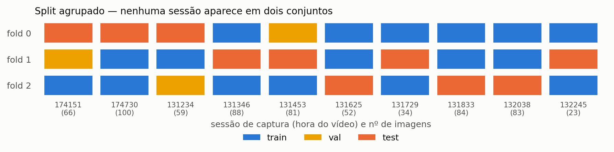

# Detecção e contagem de frutas em imagens de robô

Teste técnico — AI Engineer (Computer Vision) · Antoniq Robotics · código e detalhe de
engenharia no `README.md` do repositório

> **Resumo — seis conclusões, cada uma medida.**
> **(1) O split é o resultado** *(§2)*: as 670 imagens são quadros de dez vídeos; um split
> aleatório reportaria **AP50 0,81** onde o split por sessão entrega **0,55**, inflando **+75,5%**
> o AP-small, que é 69,5% deste dataset. **(2) O tiling perdeu, e não é defeito do tiling**
> *(§4)*: imagem inteira a 640 vence em todas as colunas e custa **8× menos** que recortes de
> 320 — os pesos foram treinados em imagem inteira, e o recorte joga a fruta para 4× a escala de
> treino. **(3) O IoS resolve a duplicata de borda, mas não melhora a contagem** *(§4)*: contra
> o IoU vence em **76%** dos pareamentos em precisão e **0%** em recall — e na MAE, em apenas
> **34%**. **(4) Uma única sessão responde por 52,7% dos falsos negativos** *(§5)*, a 2,29× a
> taxa média: o gargalo é deriva de domínio entre dias, não arquitetura. **(5) A análise de erro
> apontou um alvo e o alvo respondeu** *(§6)*: ampliar a augmentação de brilho até cobrir a faixa
> das sessões que falham comprou **−16,2% de MAE**, mais do que quadruplicar os parâmetros.
> **(6) Veredito: NO-GO** *(§5)* — o viés agregado é **−2,0%** e passa na trava de 3%, mas a pior
> sessão erra **+166%** e reprova. É por isso que o critério tem três travas e não uma.

---

## 1. Dataset e limitações

**MinneApple**, subconjunto de detecção — escolhido em vez de um conjunto de morango do Roboflow
por reunir três coisas que nenhum deles tem junto: baselines publicados; imagens que são quadros
de um percurso ao longo de fileiras, a geometria de captura de um robô; e nomes de arquivo que
preservam sessão e índice de quadro, o que viabiliza o split honesto e o bônus de deduplicação.

São **670 imagens rotuladas** de 720 × 1280 (retrato), com **28.182 instâncias**, 42,1 maçãs
por imagem e até **123** numa só. O lado mediano da caixa é de **~27 px**: 69,5% do dataset cai
na faixa *small* do COCO, 30,5% em *medium* e **0% em *large***.

**Limitações declaradas.** Maçã não é framboesa — o que transfere é o método, não os números.
A licença é **não comercial**. O split de teste oficial tem rótulos retidos, então todas as
métricas vêm de validação cruzada sobre as 670 rotuladas, protocolo mais duro que o do artigo e
não comparável a ele. Não há objeto *large*, então `AP_large` é indefinido. E, o mais
consequente: **a anotação cobre apenas fruta em árvore de primeiro plano** — fruta no chão e ao
fundo fica sem rótulo. Não é ruído, é decisão de escopo que penaliza detecção correta, e vira o
modo de erro nº 1 da §5.

> O artigo descreve as imagens como "1280 × 720". A verificação dos 1001 arquivos mostra
> **720 de largura por 1280 de altura** — o artigo escreve altura × largura. Propagada para
> dentro de um transform de coordenada, essa inversão troca todas as caixas sem levantar erro.

---

## 2. Metodologia: o split é o resultado mais importante

As 670 imagens **não são independentes**. São quadros de dez vídeos, gravados caminhando a ~1 m/s
ao longo de fileiras, com um quadro a cada cinco — cerca de **17 cm entre imagens vizinhas**. O
nome do arquivo entrega a sessão: `20150921_131453_image1101.png`.

E as sessões são regimes distintos, não amostras: a densidade varia de **21,9 a 98,1 maçãs por
imagem** e o brilho de 100 a 143 por imagem — ou, medido só **dentro das caixas**, de 54 a 166,
com as duas sessões de 19/09 sozinhas acima de 164.

Um split aleatório por imagem coloca quadros quase idênticos em treino e teste. Num baseline
aleatório treinado de propósito para medir isso, **10 das 10 sessões aparecem simultaneamente em
treino e teste do mesmo fold**. O vazamento é total, não parcial.

**O que foi feito:** `GroupKFold` sobre as sessões, três folds (364/378/392 de treino). Cada
imagem é testada exatamente uma vez, o que permite agregar sobre as 670 e ainda reportar desvio
entre folds. **A validação também sai de uma sessão inteira e separada** — usar quadros do mesmo
vídeo do treino para early stopping reintroduziria o vazamento pela porta dos fundos.

**Quanto isso custaria em métrica inflada?** A evidência estrutural já basta para rejeitar o
split aleatório — 10/10 sessões em ambos os lados não é um vazamento parcial que se possa
descontar. Para além disso, um modelo foi treinado com split aleatório e avaliado **nas mesmas
imagens** do teste agrupado, o que remove a diferença de composição do conjunto:

| Split | AP | AP50 | **AP-small** | F1 | MAE | viés |
|---|---|---|---|---|---|---|
| aleatório (vazado) | 0,395 | **0,812** | **0,333** | 0,781 | 8,6 | **+20,0%** |
| agrupado (honesto) | 0,259 | **0,548** | **0,190** | 0,625 | 20,5 | −5,1% |
| **inflação** | **+52,4%** | **+48,1%** | **+75,5%** | +25,1% | **−57,8%** | |

A maior inflação é em **AP-small**, a faixa que representa 69,5% deste dataset: é a métrica que
mais importa aqui e a que mais mente. E o modelo vazado ainda tem **+20,0% de viés** — pelo
critério da §3 ele reprovaria antes de qualquer discussão de MAE, e o "erro cortado pela metade"
é sobrecontagem sistemática, não competência. *É um limite superior: o delta soma vazamento de
quadro, cobertura de domínio e early stopping sobre uma validação também sorteada; separá-los
exige o braço de controle da §8.*

**Separação entre escolher e medir.** Braço, limiar e política de fusão são escolhidos **na
validação**, por fold; o teste do fold *k* só é lido depois, no ponto que a validação do fold *k*
congelou (§4). Sem isso o número reportado seria um mínimo sobre milhares de combinações calculado
no próprio conjunto de avaliação — e o caso mais indefensável seria o critério da §3, que exige
|viés| ≤ 3%: a varredura escolheria o limiar de menor viés no teste e o critério passaria por
construção. A regra usada é **menor MAE sujeito a |viés| ≤ 3%**, que espelha o critério.

---

## 3. Baseline e a métrica de aceitação

**YOLO26n** treinado a 640 px — 2,5 M parâmetros e 5,8 GFLOPs, medidos no próprio checkpoint.
O tamanho que um Jetson roda.
Escolhido pela viabilidade em edge: atribuição de rótulo ciente de alvo pequeno (STAL), cabeça
NMS-free e export limpo para TensorRT por não levar DFL no grafo.

| AP@[.5:.95] | AP@0,50 | AP-small | AR@300 | F1 | MAE | MAPE | latência |
|---|---|---|---|---|---|---|---|
| **0,287** ± 0,076 | **0,621** ± 0,164 | 0,206 ± 0,055 | 0,389 | **0,622** ± 0,106 | 21,4 ± 9,4 | 65,9% | 16 ms |

*± é o desvio entre os três folds: variação entre **sessões de captura**, não incerteza do
estimador. Não é intervalo de confiança.*

Duas colunas dizem mais que o AP: **R² = −0,257** e **inclinação = 0,358**. O R² negativo
significa que prever a contagem média seria melhor que o sistema; a inclinação diz por quê — a
contagem prevista cresce só 0,36 por unidade de contagem real. **O modelo comprime.** (O r² da
regressão `previsto ~ real` daria **+0,132**, bem mais lisonjeiro — são medidas diferentes, e
reportar a gentil esconderia o defeito.)

### Qual métrica eu usaria como limiar de aceitação

**Não seria mAP.** Ele é livre de limiar e dominado por qualidade de localização em IoU alto. Um
produto de contagem roda em **um** ponto de operação, e o cliente não compra precisão de caixa —
compra um número de frutas.

**Métrica principal: erro relativo de contagem na unidade de agregação do negócio** — por planta
ou por fileira, não por imagem. Mais duas travas. **Viés**, porque ao somar ao longo de uma
fileira o erro aleatório se cancela e o viés se acumula. E **F1 no ponto de operação**, contra a
armadilha central: um falso positivo e um falso negativo na mesma imagem se cancelam e o erro de
contagem vai a zero — MAE baixa pode ser competência ou sorte, e só o F1 separa.

> **Go/no-go para uma V1:** erro relativo médio por fileira ≤ 10% · |viés| ≤ 3% · nenhuma
> condição (luz, variedade, data) acima de 15%.

---

## 4. Inferência em alta resolução

Quatro estratégias, **os mesmos pesos** — a variável controlada é a inferência. Cada braço
avaliado no teste, no ponto que a **validação** escolheu para ele:

| Braço | passes | redundância real | AP | AP50 | F1 | MAE | latência |
|---|---|---|---|---|---|---|---|
| **A · imagem 640** ✔ | 1 | 1,00× | **0,287** | **0,621** | **0,622** | **21,4** | **16 ms** |
| B · imagem 1280 | 1 | 1,00× | 0,246 | 0,537 | 0,537 | 31,1 | 23 ms |
| C · tile 640 | 6 | 2,67× | 0,204 | 0,463 | 0,532 | 29,7 | 57 ms |
| D · tile 320 | 15 | 1,67× | 0,045 | 0,135 | 0,177 | 49,0 | 130 ms |

✔ braço congelado — e o único cujo viés de teste (−2,0%) cabe na trava de 3% da §3.

*Duas correções de protocolo que este número exigiu, e que valem mais que ele.* **(i)** A grade de
limiares tinha passo 0,05 e não amostrava a própria restrição que impunha: o viés do braço A é
monótono em `conf` e cruza zero entre 0,12 e 0,14, então a grade saltava de +10,3% para −4,1% e o
braço aparecia como **inviável** sob |viés| ≤ 3% — com o passo em 0,01, os quatro braços são
viáveis. **(ii)** A seleção usava a união das três validações e a avaliação usava a união dos três
testes; como a sessão de validação de cada fold é sessão de **teste** de outro, **206 das 670
imagens de teste (30,7%) estavam no pool que escolhia braço, limiar e política**. A seleção passou
a ser por fold, e o fold *k* é lido no ponto que a validação do fold *k* escolheu. O `assert` de
vazamento não pegava: ele verifica dentro de um fold, e este nascia na agregação. Custo da
correção no braço B: MAE **23,5 → 31,1** e viés **+5,0% → +13,8%**.

**O tiling perde em todas as colunas e custa de 3,7× a 8,3× mais.** A conclusão honesta não é
"tiling não serve", e sim que **para um modelo treinado em imagem inteira a 640 o tiling joga o
objeto para fora da distribuição de treino**. Dois confundidores, declarados. **(i)** Os pesos
favorecem o braço A: a maçã vista no treino tem mediana de 13,6 px, e na inferência a rede vê
13,6 px no A, 27,3 no B e no C e **54,6 no D** — 4,0× a escala de treino contra 1,5× de cobertura
da augmentação; se o D perde, é da receita. **(ii)** A sobreposição configurada não é a real: um
tile de 640 não cabe duas vezes em 720, a grade colapsa, e o braço C tem sobreposição real de
**0,875 em x** (não 0,2), olhando cada pixel **2,67 vezes** contra 1,67 do D — parte do que ele
ganha é *ensemble*. Vale explicitar o que raramente se diz: **recortar em 640 e alimentar a rede
em 640 não aumenta o objeto** — o C só reduz a densidade por passe, e a magnificação real só
aparece no D.

### O ponto técnico: IoU não serve para fundir entre tiles

Uma fruta cortada pela aresta de um tile produz uma caixa com ~metade da área da que o tile
vizinho gera para a mesma fruta. O **IoU** entre as duas fica em torno de 0,45–0,50 — em cima do
limiar usual, e a duplicata escapa de forma imprevisível. O **IoS** (interseção ÷ área da **menor**
caixa) dá ~1,0 e a remove sem ambiguidade.

Não é detalhe acadêmico: o baseline *Tiled Faster R-CNN* do próprio artigo do MinneApple ficou
**abaixo** da inferência em imagem inteira (AP 0,341 vs 0,438), e os autores atribuem a perda ao
passo de supressão. A ablação varre o braço C em **24 políticas × 90 limiares × 3 folds**, e
cada eixo abaixo é marginalizado sobre ela:

**Métrica:** IoS dá MAE **30,61** contra **32,11** do IoU, e precisão **0,718** contra 0,705 —
mas recall 0,509 contra **0,515**, o único eixo em que ele perde. **Política:** NMM (união)
**31,21** contra 31,51 do NMS. **Borda:** descartar truncadas **31,13** contra 31,60.

![Comparação PAREADA: para cada configuração idêntica em política, limiar de casamento, descarte de borda, limiar de confiança e fold, quem venceu. A linha tracejada é o empate. O IoS domina em precisão e fica ABAIXO dela na MAE de contagem — é a dissociação inteira numa figura. Marginalizar a MAE sobre a grade de confiança daria um número que não corresponde a ponto de operação nenhum: acima de conf 0,7 o detector quase não devolve caixa, a MAE tende à contagem real e a política de fusão deixa de importar.](../results/figures/04_ablacao_fusao.png)

**O IoS faz o que promete, e isso não basta.** Pareado configuração a configuração
(**3.240 pares**: 12 configurações de fusão × 90 limiares × 3 folds), ele vence o IoU em **77%
dos casos em precisão** e **65% em F1** — mas em **0,4%** em recall (12 de 3.240): ele sempre
remove mais. É a confirmação direta do mecanismo, e é o que se quer de um controle de duplicata.
**Na MAE de contagem, porém, o IoS vence em apenas 37%**, e no regime que interessa —
os limiares onde o viés cabe em 3% — os dois empatam (**9,92 contra 9,96**). Num sistema que já
subconta, remover mais caixas empurra a contagem para o lado errado.

*Uma versão anterior desta seção afirmava "IoS bate IoU em 12 de 12".* Aquilo foi medido numa
grade de 13 limiares; com 90, a afirmação não sobrevive. **O ganho do IoS é de qualidade de
detecção, não de contagem** — a mesma dissociação que a §3 usa para rejeitar o mAP como critério
de aceitação, aparecendo agora no eixo da fusão. A pior combinação continua sendo
`iou-nms@0.7-keep` (MAE 111,8), a mais próxima do que o baseline do artigo fazia.

**Onde o tiling machuca.** Fruta mais larga que a faixa de sobreposição não é vista inteira por
tile nenhum e vira duas detecções — regime real mas pequeno aqui: a fruta mais larga do dataset
tem **81 px** (a mais alta, 89) e só **0,23% delas** excedem a faixa de 64 px do tile 320. O modo de falha que domina é outro:
em cena esparsa com fundo visível, o tiling magnifica árvore de fundo e céu e produz **126 falsos
positivos contra 21** da imagem inteira (18 maçãs anotadas, contagem 143 contra 37). E mesmo onde
o tiling *ajuda*, o ganho não é recall: numa cena de 70 maçãs ele recupera 7 detecções perdidas e
**corta 57 falsos positivos** — o benefício vem de suprimir excesso, não de enxergar mais.

---

## 5. Contagem e modos de erro

### O agregado mente; o pior caso denuncia

O braço congelado erra a contagem agregada em **−2,0%** — dentro da trava de 3%. E é a única
trava que ele cumpre: o agregado esconde o que acontece por dentro.

| Sessão | maçãs/img reais | previstas/img | erro |
|---|---|---|---|
| 20150919_174151 | 98,1 | 14,2 | **−85%** |
| 20150919_174730 | 31,2 | 14,3 | **−54%** |
| *(oito sessões de 21/09)* | 21,9 a 57,3 | 34,3 a 64,3 | **−6% a +166%** |

As duas sessões de **19/09** subcontam; as oito de **21/09** sobrecontam. É deriva de domínio
entre dias de captura, não erro aleatório — e é a mesma compressão que a inclinação 0,358 mostra.

Aplicando o critério da §3: erro médio por sessão **54,3%** (reprova), pior sessão **166%**
(reprova), amplitude **251 pontos** — e viés agregado **−2,0%**, que **passa**. A aprovação
isolada do viés é o argumento inteiro: um sistema que erra de −85% a +166% entre dias de captura
exibe um agregado de −2% e passaria numa revisão que olhasse só o total.

E a decomposição é exata (`previsto − real = FP − FN`): **10.229 falsos negativos** (recall
63,7%) contra **10.769 falsos positivos** (16,1 por imagem). O erro **líquido** é de **+540** — o
que aparece na contagem — enquanto o **bruto** é **20.998**, **trinta e nove vezes maior**. A
diferença entre os dois é cancelamento, não acerto.

Um detalhe que vale explicitar, porque os dois números convivem no texto: esta decomposição é
calculada num **limiar único congelado** (`conf` 0,13, o de `operating_point.json`), para que os
estratos da §7 sejam comparáveis entre si; o viés de **−2,0%** acima vem da tabela dos braços,
onde cada fold é lido no limiar que a **validação daquele fold** elegeu — média 0,163. É a mesma
imagem, o mesmo modelo e a mesma política de fusão; muda só o ponto de operação. Três centésimos
de limiar viram **1.100 maçãs** de diferença e **invertem o sinal** do viés agregado, de −2,0%
para +1,9%. Não é contradição: é a sensibilidade que a calibração abaixo mede, e é a razão de o
ponto de operação ser um artefato versionado em vez de um número escolhido no fim.

**Calibração: o ótimo de detecção não é o ótimo de contagem.** Varrendo 90 limiares na
validação, o braço congelado maximiza F1 em **0,22** e minimiza a MAE de contagem em **0,13** —
e o viés cruza zero nesse mesmo 0,13. Não são três pontos, são **dois**, e a distância entre eles
é o que custa: no limiar que otimiza F1 o sistema **subconta 17,0%**; no que otimiza a contagem,
o viés é **+0,8%** e o F1 cai de 0,750 para 0,734. Calibrar por F1 e reportar contagem descreve
um sistema que nunca foi configurado assim. *(Números em `results/calibration_optima.json`;
curvas em `results/figures/05_calibracao.png`.)*

### Ranking dos modos de erro

Ordenado por **excesso de perda sobre a taxa média**, não por contagem bruta — ordenar por
contagem elege o estrato mais *populoso*, que costuma ser o mediano e não o problemático.

**Uma única sessão é o modo dominante:** perde 83,2% da sua fruta, a 2,29× a taxa média. Uma
versão anterior desta tabela excluía o fator "sessão" do ranking e concluía que a perda se
concentrava em oclusão — deixando no lugar o proxy "iluminação", que está confundido com sessão.
Removido o confundidor real, a conclusão invertia. **Em maçãs**, o maior contribuinte de subcontagem é *small* (−8.731); **em
intensidade**, é a sessão (2,29×). Os dois números respondem perguntas diferentes e o relatório
precisa dos dois. Os demais fatores que o enunciado pede aparecem todos na figura, e nesta
ordem de intensidade: **iluminação** (1,34× a taxa média), **aglomeração em cacho de 6–10 frutas**
(1,22×, −3.702 maçãs), **borda** (1,14×) e **oclusão** por solidez (1,12×). O intervalo entre eles
é estreito — o que separa o problema não é o fator, é a **sessão**. *Ressalva:* os fatores se
sobrepõem e as frações não somam 1 — é uma lista de lentes, não uma decomposição.

### As duas correções que eu faria — no dado, não no modelo

**1. O escopo de anotação está indefinido, e isso treina o modelo a errar.** Fruta no chão e em
árvores de fundo fica sem rótulo, então o modelo aprende a *suprimir* maçãs reais e toda detecção
de fundo vira falso positivo — os **10.769 FP**, o maior item do ranking, incluem fruta correta
que o protocolo decidiu não contar. *Correção:* atributo explícito de **plano** no schema, e
melhor ainda capturar com **RGB-D ou estéreo de baseline fixa**, definindo o plano de contagem
por **geometria em vez de julgamento do anotador**. Num corredor de estufa, um corte por
profundidade elimina a classe de erro inteira.

**2. A regra de fração mínima visível não existe — e ela é quantificável.** O ground truth tem
falsos negativos próprios (anotador único, 30 min por imagem), então a taxa de perda está inflada
e parte dos "falsos positivos" é fruta real. Pior, a ausência da regra se propaga: ao montar os
recortes de 320 px com corte em 35% de visibilidade, **2.456 maçãs visíveis ficaram sem rótulo — 9,32%
de toda a fruta visível nos tiles de treino**, ensinando "fruta cortada = fundo". *Correção:*
fixar a fração mínima no schema (ex.: ≥20%), e **dupla anotação cega com adjudicação** numa
subamostra estratificada, publicando a concordância inter-anotador como **piso de ruído** — sem
ele não há como saber se o modelo bateu no teto do dado. Para framboesa, que agrupa muito mais
que maçã, é o risco número um.

---

## 6. Experimentos: qual alavanca move a agulha

Oito conjuntos de pesos, todos medidos **pelo pipeline inteiro** — recorte, detecção, fusão,
contagem — no mesmo teste, cada um no braço e no limiar que a **sua** validação escolheu:

| pesos | braço | MAE | MAPE | viés | F1 | recall | AP50 | AP-small |
|---|---|---|---|---|---|---|---|---|
| **YOLO26s @1280 + aug** (9,9 M) | B_full1280 | **12,6** | **27,8%** | **−18,3%** | **0,752** | **0,683** | **0,762** | **0,352** |
| YOLO26s @1280 (9,9 M) | B_full1280 | 15,1 | 29,6% | −28,4% | 0,738 | 0,633 | 0,742 | 0,337 |
| YOLO26m @1280 + aug (21,8 M) | B_full1280 | 19,3 | 30,0% | −34,6% | 0,695 | 0,575 | 0,683 | 0,314 |
| YOLO26n @1280, 90 ép | B_full1280 | 24,7 | 36,1% | −47,1% | 0,634 | 0,484 | 0,643 | 0,290 |
| recortes de 320 px | D_tile320 | 26,6 | 40,7% | −50,7% | 0,607 | 0,453 | 0,487 | 0,227 |
| YOLO26n @1280, 124 ép | A_full640 | 31,1 | 55,4% | −58,9% | 0,507 | 0,358 | 0,463 | 0,157 |
| YOLO11s @640 (9,4 M) | A_full640 | 33,0 | 47,2% | −62,2% | 0,474 | 0,327 | 0,475 | 0,204 |
| baseline @640 (2,5 M) | A_full640 | 33,2 | 54,6% | −62,6% | 0,465 | 0,319 | 0,439 | 0,158 |

**Do baseline ao melhor: MAE −62,0%, recall +113,9%, AP-small +122,8%**, com a precisão custando
apenas 2,1% (0,854 → 0,836). O viés sai de −62,6% para −18,3%.

**Resolução primeiro, capacidade depois, e ambas saturam.** A 640 px a maçã mediana chega à rede
com 13,6 px e não há sinal para um modelo maior usar: o YOLO11s, com 4× os parâmetros, empata com
o baseline (33,0 contra 33,2). A 1280 px ela chega com 27 px e a capacidade paga — 2,5 M → 9,9 M
leva a MAE de 24,7 para 15,1. **O degrau seguinte não paga**, e a comparação é limpa: 9,9 M e
21,8 M com **a mesma augmentação** dão **12,6 contra 19,3**. **O joelho está em ~10 M**, coerente
com 450 imagens de treino — acima disso o modelo decora as seis sessões.

**A alavanca que mais pagou não foi capacidade — foi a augmentação que a §5 encomendou.** Os dois
YOLO26s têm treino idêntico — modelo, resolução, `batch`, orçamento de épocas, paciência,
semente — menos a augmentação:
`hsv_v` 0,40 → 0,75, `hsv_s` → 0,90, `scale` 0,5 → 0,35, `close_mosaic` 30. **MAE 15,1 → 12,6
(−16,2%)**, recall **+7,8%**, viés de **−28,4% para −18,3%**. O brilho é a peça que a §5 encomendou e está
medida em `dataset_summary.json`: o V médio **dentro das caixas** é 98,2 nas seis sessões de
treino e **164 / 166** nas duas de 19/09, que são as que o modelo mais erra — com `hsv_v = 0,40`
o treino alcança 98,2 × 1,40 = **137** e nunca vê aquela faixa; com 0,75 alcança **172**. *As
quatro mudanças entraram juntas, então o ganho é da receita e não isoladamente do brilho — o
teste que separaria as peças é uma varredura de um fator por vez, que não coube.* Ainda assim, a
análise de erro apontou um alvo e o alvo respondeu: é a justificativa mais forte deste relatório
para gastar o dia em diagnóstico antes de gastá-lo em arquitetura.

**A correção mais útil deste relatório.** Comparando o mesmo YOLO26n a 1280 px com 90 e com 124
épocas, o mAP de **validação** fica parado — 0,4478 contra 0,4480. Pelo mAP, épocas extras não
comprariam nada. No **teste, com o pipeline completo**, a MAE cai de **24,7 para 19,1 (−22,8%)** e
o F1 sobe de 0,634 para 0,715. Uma decisão de "parar de treinar" tomada pelo mAP de validação
teria jogado fora 23% do erro de contagem. É a tese da §3 medida contra o próprio autor.

**E a fragilidade da seleção, medida — duas vezes.** Para esse mesmo modelo de 124 épocas, a
validação preferiu `A_full640` (4,27) a `B_full1280` (4,65) — **0,38 maçã em 81 imagens**, e no
teste isso custou **31,1 contra 19,1: doze pontos de MAE decididos por ruído.** Entre os dois
YOLO26s repetiu: a validação preferiu o **sem** augmentação por **0,90 maçã**, e no teste o
**com** ganha por 2,45. Não troquei nenhuma escolha depois de ver o teste — as linhas da tabela
são o que cada validação elegeu. **Calibrar numa única sessão é o elo mais fraco do pipeline**, e
é aí que o próximo esforço deve ir, não em mais parâmetros.

**Ressalva de escopo.** **n = 1 treino por condição, uma semente**, só no fold 0 — cuja validação
é uma sessão e cujo teste são três outras, daí os viéses de −18% a −63% aqui contra −2,0% do braço
congelado da §4. Estas MAEs **ordenam** os modelos; não são números de produto. E um par não é
ablação limpa: o YOLO11s muda arquitetura, cabeça e pré-treino além do tamanho. Os outros dois
isolam: 9,9 M contra 21,8 M com a mesma augmentação, e o mesmo 9,9 M com e sem ela.

---

## 7. Deployment e bônus

**Preparação para deployment.** Congelar o ponto de operação — limiar, tile, política de fusão —
como configuração versionada junto do checkpoint: o modelo sozinho não é o sistema. Exportar
PyTorch → ONNX → engine TensorRT **construída no próprio Jetson** (a engine é específica de
hardware e versão), FP16 antes de INT8, medindo latência do lote de tiles e não por tile. Em
operação, monitorar deriva da contagem por fileira e manter um **canário rotulado por estufa**,
que dada a §5 é o item que mais importa. *Licença:* o Ultralytics é AGPL-3.0; produto embarcado
fechado exigiria Enterprise ou um detector permissivo (RT-DETR, RF-DETR).

*As latências deste relatório são de uma RTX 3050 Laptop, não de um Jetson: as razões entre
braços transferem, os absolutos não.*

**Bônus: supressão de duplicatas entre quadros.** Deslocamento estimado por correlação de fase
em OpenCV, caixas do quadro anterior transportadas, casamento por sobreposição, contagem de
**trilhas** em vez de detecções. Como nenhum dataset público rotula identidade entre quadros, a
sequência é construída: uma janela varre cada imagem rotulada com deslocamento conhecido de
60 px, cinco posições.

Nas 668 imagens, a soma ingênua por quadro dá **100.392 — 3,56× a verdade**; após deduplicação,
**28.180**, que é exatamente a contagem única verdadeira: **erro 0 em 668 de 668**.

*Ressalva: o rastreador recebeu as anotações no lugar de detecções, o que isola o mecanismo e
não mede desempenho de produto.* Em **sequências reais** (26 trechos), 13.595 observações viram
5.538 trilhas, com |dx| mediano de **27,6 px**, |dy|/|dx| = 0,195, e **12 trechos indo para +x e
14 para −x**. O estimador recupera sozinho que a câmera translada na horizontal com direção
invertida entre sessões — exatamente o protocolo do artigo: caminhar por um lado da fileira e
voltar pelo outro.

**Modo de falha que esse regime esconde:** a contagem única é o número de trilhas, sem
comprimento mínimo — com detector real, cada falso positivo de um quadro cria uma trilha. Exigir
que uma trilha apareça em ≥2 quadros é a primeira coisa a acrescentar, e vira um filtro de falso
positivo de graça que a inferência quadro a quadro não tem como fazer.

---

## 8. O que eu faria em seguida

Priorizado pelo que a análise mostrou, não por intuição. Dois itens da lista anterior saíram dela
porque viraram experimento (§6).

1. **Consertar o domínio antes do modelo — e já há prova de que paga.** O erro dominante é deriva
   entre dias de captura, de −85% a +166% por sessão. A §6 testou atacar exatamente isso: ampliar
   a augmentação de brilho até cobrir a faixa das sessões que falham comprou **−16,2% de MAE e
   −10 pontos de viés** sem trocar uma linha de arquitetura — mais do que quadruplicar os
   parâmetros comprou. O caminho continua: cobertura de condições na captura, um protocolo que
   fixe exposição e distância, e **recalibração do limiar por estufa**.
2. **Calibrar em mais de uma sessão, antes de qualquer coisa de modelo.** A §6 mede o custo do
   elo fraco: **doze pontos de MAE decididos por 0,38 maçã** de diferença na validação de uma
   sessão. Reservar duas sessões para calibração, ou escolher o ponto por pior-caso entre sessões
   em vez de média, custa um dia e vale mais que dobrar o modelo — que já mediu saturação.
3. **Parar de subir o modelo.** A §6 mediu o joelho: 2,5 M → 9,9 M derruba a MAE de 24,7 para
   15,1; e com a augmentação igualada, 9,9 M dá **12,6** contra **19,3** dos 21,8 M. Com 450
   imagens de treino, capacidade acima de ~10 M vira decoração das seis sessões. A cabeça P2
   (stride 4) segue *condicional* e agora menos provável — a §6 indica que a falta de resolução se
   resolve na entrada, não no mapa de features.
4. **Terceiro braço de controle** — 10 sessões no treino, sem os quadros vizinhos do teste — para
   separar vazamento de cobertura de domínio.
5. **Agrupar por fileira, não por sessão.** O teste oficial se chama `dataset1_front` /
   `dataset1_back` — cada fileira é filmada dos dois lados, e os dois lados não compartilham
   pixels: ORB + RANSAC sobre os **199.212 pares entre sessões** não achou **um único** com
   repetição de cena (máx. 13 *inliers*), contra **300/300** num controle de quadros vizinhos.
   Mas a fileira compartilha árvores e luz, e o dataset não expõe essa granularidade.

---

## Siglas

| | | | |
|:---|:---|:---|:---|
| **MAE** | erro absoluto médio de contagem, em maçãs | **IoU** | interseção ÷ **união** de duas caixas |
| **MAPE** | o mesmo, em % da contagem real | **IoS** | interseção ÷ área da **menor** — mata a duplicata de borda |
| **AP / AP50** | *average precision* média em IoU 0,50–0,95 / fixa em 0,50 | **NMS** | *non-maximum suppression* — descarta a caixa de menor score |
| **AP-small** | AP restrito a objetos < 32² px (69,5% deste dataset) | **NMM** | *non-maximum merging* — funde as duas na união |
| **AR@300** | *average recall* com até 300 detecções por imagem | **TP/FP/FN** | acerto / detecção sem anotação / anotação perdida |
| **mAP** | AP média entre classes — aqui há uma só, então mAP = AP | **COCO** | benchmark cujos cortes de área (*small/medium/large*) são usados |
| **F1** | média harmônica de precisão e recall, no ponto de operação | **STAL** | atribuição de rótulo do YOLO26, ciente de alvo pequeno |
| **R²** | concordância com a reta *y = x*; negativo = pior que prever a média | **DFL** | *distribution focal loss* — ausente no YOLO26, o que limpa o export |
| **r²** | ajuste de uma regressão livre — mais lisonjeiro, e não é o mesmo | **ORB/RANSAC** | detector de pontos e ajuste robusto, usados na busca por cena repetida |
